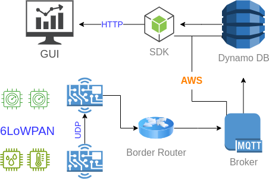
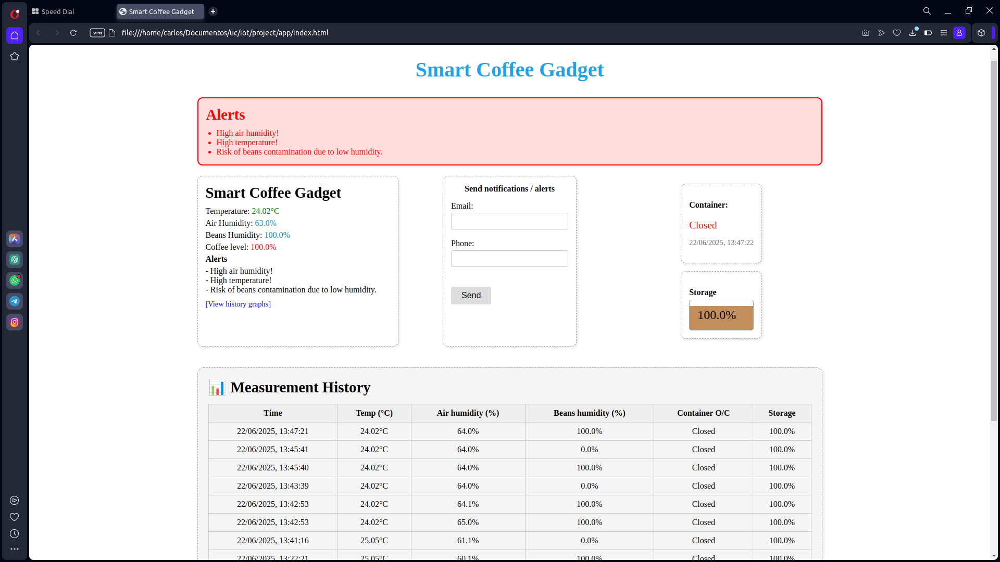

# Coffee Storage Monitoring System ☕

This project implements a monitoring system for a coffee bean storage container using Contiki-NG and IoT devices (Zolertia RE-Mote). It collects temperature, air humidity, bean humidity, and container lid status data and displays them in a web interface via an AWS Lambda backend.

## 🌐 Architecture



## 🖥️ Interface



## 📦 Technologies

- 🔧 **Contiki-NG**: OS for IoT nodes (Zolertia)
- 🌡️ **Sensors**: DHT22 (temperature and humidity), ADC (voltage for bean humidity), gyroscope (lid angle)
- ☁️ **AWS**: Lambda, DynamoDB, API Gateway, S3
- 🧠 **Backend**: Python (Lambda function)
- 🌍 **Frontend**: HTML, JS, Chart.js

## 📊 Features

- Displays current and historical temperature, humidity, and container status
- Charts showing variation over time
- Alerts for high humidity, low storage, temperature anomalies, etc.

## 🚀 Getting Started

### 1. Clone this repository
```bash
git clone https://github.com/carlosthassius/coffee_storage.git
cd coffee_storage
```

### 2. Compile and flash code
Use `make` to compile Contiki-NG applications for RE-Mote nodes (sensor and router).

### 3. Set up MQTT Bridge
Bridge UDP data from RE-Mote to local MQTT broker on Raspberry Pi.

### 4. Set up Backend
Deploy `lambda_function.py` in AWS Lambda and connect it to API Gateway.

### 5. Set up Frontend
Deploy frontend files in an S3 bucket as a static website.

## 🛠️ Run tunslip6 script

Use the following shell script to start `tunslip6` continuously. You can specify the serial port as the first parameter:

```bash
#!/bin/bash
TUNSLIP="$HOME/contiki/tools/tunslip6"
SERIAL_PORT=${1:-/dev/ttyUSB0}
IP_PREFIX="fd00::1/64"

while true; do
    echo "Starting tunslip6 on $SERIAL_PORT..."
    sudo $TUNSLIP -v2 -s $SERIAL_PORT $IP_PREFIX
    echo "tunslip6 stopped. Restarting in 3 seconds..."
    sleep 3
done
```

## 📎 Authors
Carlos Freire & David Blazheski
